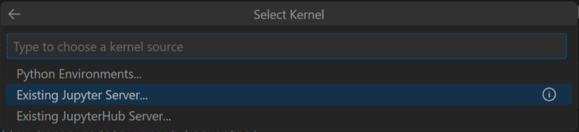

# Running Docker on HPC
Docker images could be run on High-Performance Computing cluster using tools like Apptainer. In case of Cyfronet PLGrid, Apptainer tool is installed on working nodes and we can use it after requesting for terminal in srun mode:

```
srun --time=2:00:00 --mem=1G --ntasks 1 --partition=plgrid-now --account=SPECIFIN_ACCOUNT --pty /bin/bash
```

Once resources have been allocated, we can check for Apptainer version:

```
apptainer version
```

Then we can try to reproduce our example. First create seperate directory for project, download and run container with Script of Scripts:

```
mkdir lsc-proj && cd lsc-proj
apptainer pull docker://vatlab/sos-notebook
apptainer run sos-notebook_latest.sif
```
Copy url from container logs - it would be required to connect to Jupyter Server from notebook file.

After that copy required CSV file and Jupyter Notebook:
```
scp ./trees.csv ARES_ADDRESS:~/lsc-proj/trees.csv
scp ./demo-notebook.ipynb ARES_ADDRESS:~/lsc-proj/demo-notebook.ipynb
```

Now you are able to run notebook using SoS kernel. We recommend using VSCode:
1. Start a remote SSH connection to Ares/Athena
2. Open the demo-notebook.ipynb file
3. Connect to the Jupyter server started on the worker node - choose "Existing Jupyter Server" option and paste link from Jupyter container logs


4. Run cells after choosing SoS kernel

Warning: In VSCode it is not possible to choose different subkernel for every cell (limited GUI), so we use commands to enforce it.
If you would run that container locally with browser enabled, then you could simply choose different kernels for each cell.

In LSC-Apptainer.pdf you can find whole presentation with additional info about Apptainer.
